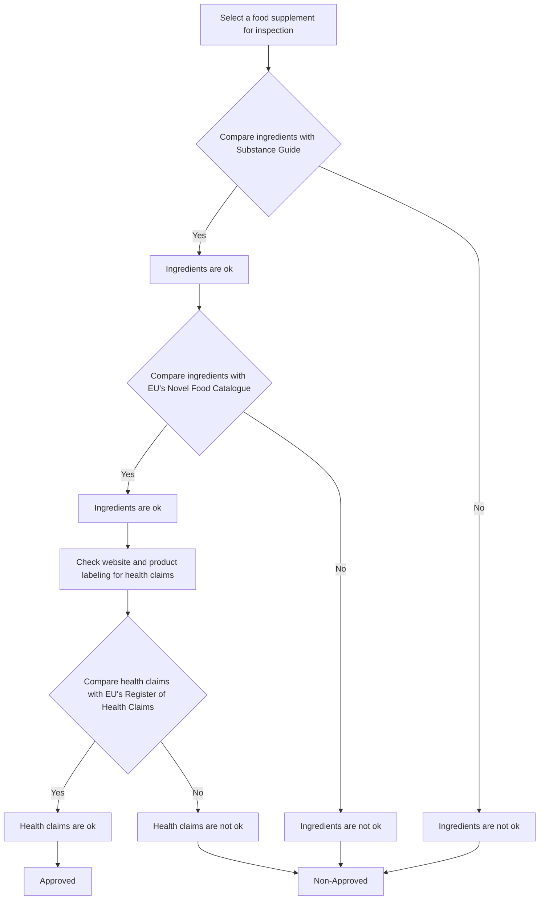

# 🥗 Uppsala Ingredient & Novel Food Analyzer


A comprehensive tool designed for **Uppsala Kommun** to validate food supplement ingredients. This application automates the complex task of checking ingredients against the **EU Novel Food Catalogue** and normalizing ambiguous ingredient names across multiple languages (English, Swedish, Latin).

The system consists of a **user-friendly GUI** for inspectors and a **high-performance AI backend** for semantic synonym resolution.

---

## 🚀 Key Features

### 🖥️ The Interface (Frontend)
* **Real-time Novel Food Checking:** Instantly flags ingredients as "Novel" (Red), "Not Novel" (Green), or "Unknown" (Orange).
* **Batch Processing:** Paste entire label texts; the tool parses, cleans, and identifies individual ingredients automatically.
* **Smart Highlighting:** Visual cues for quick regulatory decision-making.

### 🧠 The Intelligence (Backend)
* **Multilingual Normalization:** Resolves synonyms in **English, Swedish, and Latin** to their official canonical names.
    * *Example:* Input `"A-vitamin"` → Detected as `"Vitamin A"`.
* **Hybrid Search Engine:** Uses a weighted scoring system combining:
    * **Semantic Vector Search** (SentenceTransformers + FAISS) for meaning.
    * **Fuzzy Matching** (Rapidfuzz) for spelling variations.
* **Zero-Shot Deployment:** Pre-computed embedding spaces mean no training is required at runtime.

---

## 🛠️ Architecture

The project is divided into two main components:

### 1. The Analyzer GUI (`ingredientsanalyzer.py`)
A `CustomTkinter` application that serves as the interaction point. It parses raw text input and queries the underlying databases to determine the status of ingredients.

### 2. Supplement Synonym Search (`supplement-synonym-search/`)


This module is the backbone for data normalization. It solves the "vocabulary problem" where manufacturers use different names for the same substance.

* **Embedding Model:** `paraphrase-multilingual-MiniLM-L12-v2`
* **Index:** Cached FAISS index for millisecond-latency lookups.
* **Data Pipeline:** Aggregates and cleans data from pharmaceutical registries and novel food lists.

---

## 📦 Installation

1. **Clone the repository**
   ```bash
   git clone [https://github.com/Thant-Zin-Bo/Uppsala_Kommun_Ingredients.git](https://github.com/Thant-Zin-Bo/Uppsala_Kommun_Ingredients.git)
   cd Uppsala_Kommun_Ingredients
Install dependencies

Bash

pip install -r requirements.txt
(Optional) Rebuild the AI Engine If you need to update the synonym database, run the training script to regenerate vectors:

Bash

python scripts/supplement_canonical_training.py
💻 Usage
Running the GUI
To start the main analyzer application:

Bash

python ingredientsanalyzer.py
Paste a list of ingredients into the text box.

Click "Analyze Ingredients".

Review the color-coded compliance report.

Using the Search API (CLI)
To test the synonym resolution engine directly:

Bash

# Loads the cached FAISS index and runs interactive search
python scripts/supplement_canonical_training.py
Input: A-vitamin Output:

Plaintext

Canonical: vitamin a | Score: 0.90 (Semantic: 0.91, Lexical: 0.88)
📂 Project Structure
Plaintext

├── data/
│   ├── novel_foods_complete.json    # EU Novel Food Database
│   ├── embeddings_canonical.npy     # Pre-computed AI vectors
│   └── index_canonical.faiss        # FAISS Search Index
├── scripts/
│   ├── supplement_canonical_training.py  # AI Model Builder & Search Logic
│   └── preprocess_high_accuracy.py       # Data Cleaning Pipeline
├── SearchApp/
│   └── eunovelfoods.py              # Search utilities
├── ingredientsanalyzer.py           # Main GUI Application
├── requirements.txt
└── README.md
👥 Contributors
[Gustav Benkowski]: GUI Development & UX,Vector Search Implementation, & Data Normalization.

Thant Zin Bo: AI Backend, 

[Upali Bera]: Data Collection & Novel Food Database Integration.



